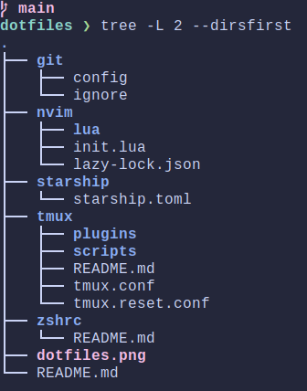

# dotfiles symlinked with stow
a repo of my dotfiles and installation scripts

## Install with stow from dotfiles directory
`stow --target ~/.config .`

### Install packages
```
stow git
stow nvim
stow tmux
stow zshrc
stow starship
```

The file structure is as shown below:



## Install Homebrew packages

```
# Leaving a machine
brew leaves > leaves.txt

# Fresh installation
xargs brew install < leaves.txt
```

